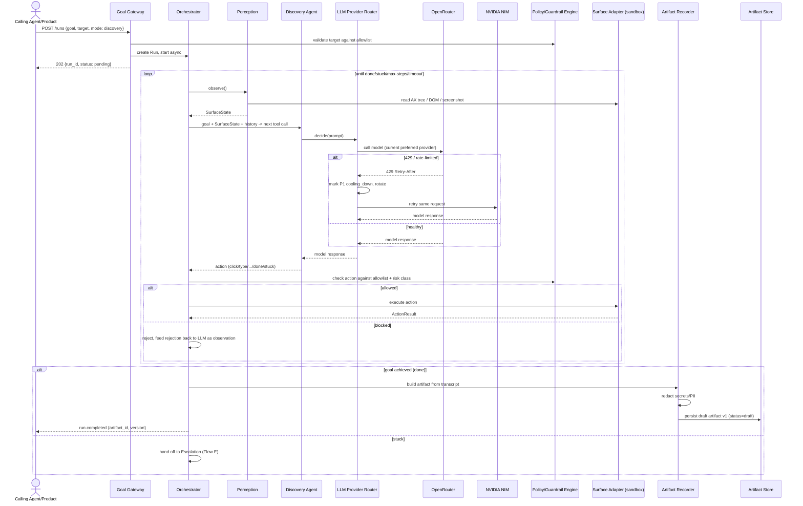
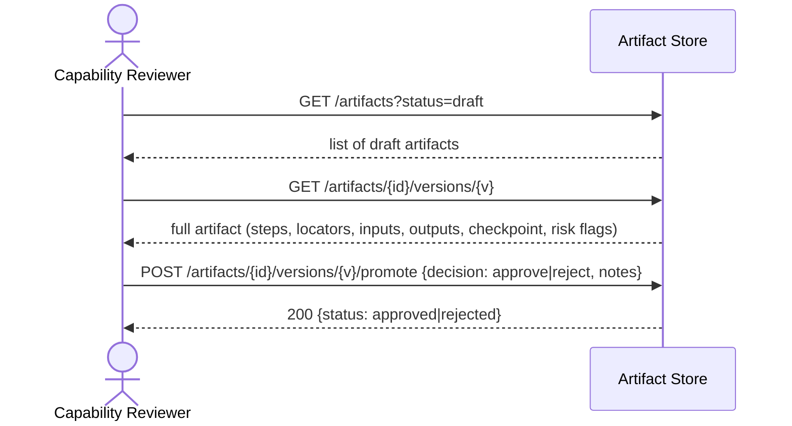
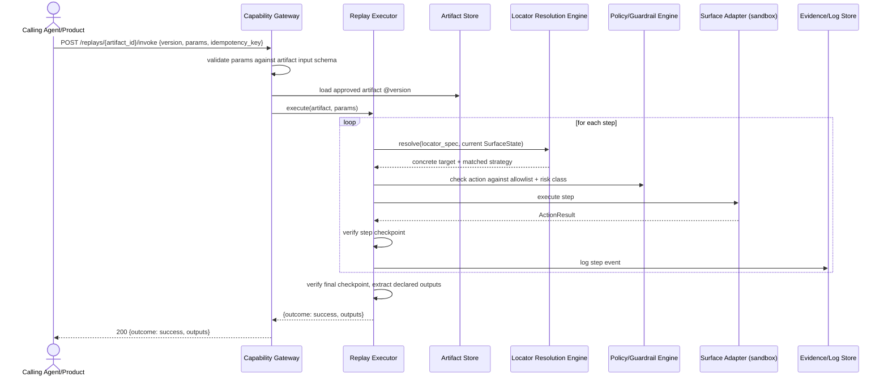
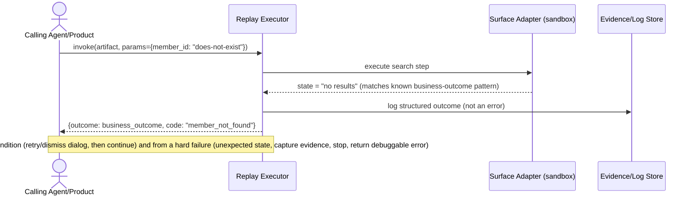
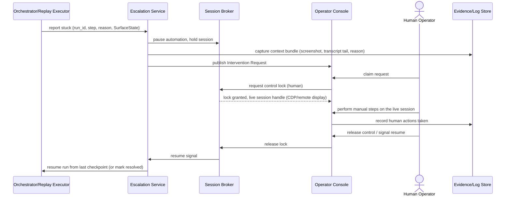

# Technical Design Document: Computer-Use Automation System for Legacy Banking Applications

**Author:** Principal Architecture Review
**Status:** Draft for stakeholder sign-off
**Scope:** Backend integration layer giving AI agents the ability to operate API-less back-office banking/credit-union applications, via LLM-driven discovery + deterministic replay.

---

## 0. Framing

The system has exactly one job to do well: turn "an LLM figured out how to do X once" into "any agent can reliably invoke X a thousand times, cheaply, without a model in the loop, and a human can always take the wheel when it can't." Everything below is organized around protecting that seam — discovery is expensive, exploratory, and model-driven; replay is cheap, deterministic, and auditable. The two must never be allowed to blur into each other, because the moment replay silently falls back to "let the model figure it out," you've lost the reliability and cost guarantees that are the entire point of recording an artifact in the first place.

---

## 1. High-Level Architecture & Domain Boundaries

### 1.1 Domain decomposition

The system splits into five domains with hard boundaries. Each domain owns its own data and is the only writer to it; everything else reads through a contract.

**Discovery Domain** — runs the LLM observe → decide → act loop against a live surface. Owns nothing durable except the raw transcript (model turns, tool calls, screenshots) used to build an artifact and then discarded or archived to cold storage. This is the only domain allowed to call an LLM for a *decision*.

**Capability Domain** — owns the Artifact: schema, versioning, storage, review/approval state, and the base/override model used for multi-tenant reuse. This is the contract layer between "what the model discovered" and "what an agent can invoke." No other domain writes artifacts.

**Execution Domain** — owns deterministic replay: the Locator Resolution Engine, the Replay Executor, checkpoint verification, and the result/outcome contract returned to the calling agent. Never calls an LLM for a decision (the bounded assisted-fallback stretch goal is the one deliberate, tightly scoped exception — see ADR-07).

**Human-Loop Domain** — owns stuck-detection, intervention requests, and the control-transfer/session-handoff mechanism. It is the only domain permitted to change *who* holds the input lock on a live session.

**Platform/Cross-Cutting** — Surface Adapters (how you perceive/act on a concrete app), the Policy/Guardrail Engine, Secrets & Redaction, and Observability (structured logs + evidence). These are shared libraries/services consumed by all four domains above, not orchestrated by any single one of them — this is deliberate, so that guardrails and redaction cannot be bypassed by a domain that "forgets" to call them.

### 1.2 Execution isolation

Every live session — discovery or replay — runs inside its own ephemeral, sandboxed execution unit: one container (or a microVM such as Firecracker/gVisor where the threat model warrants it) per active session, created for that run and destroyed at the end of it. This is not optional infrastructure polish; it's the physical enforcement layer underneath the logical guardrails described elsewhere in this document:

- **No cross-tenant or cross-run bleed.** Cookies, local storage, cache, and any transient credentials live only inside that session's container and die with it. Two runs never share a browser process or profile, even for the same tenant.
- **Network egress is allowlisted at the container boundary**, not just checked in application code — the container can reach only the specific target app domain(s) authorized for that tenant/run. This backs the Policy/Guardrail Engine with enforcement that holds even if an application-layer check has a bug.
- **Hard resource ceilings** (CPU, memory, wall-clock) are container-level limits, which is what actually makes the resource-exhaustion mitigation in §3.3 real rather than aspirational — a runaway session gets killed by the orchestration layer (e.g., Kubernetes pod limits, or a Firecracker VM budget), not by hoping application code notices in time.
- **No persistent volume.** Downloads, temp files, and any scratch state are ephemeral to the container filesystem. The only things permitted to leave the sandbox are structured log events and evidence blobs, and only after passing through the Secrets & Redaction Layer on the way out.
- **The Session Broker's control lock is the logical ownership model (automation vs. human) described in §1.2 below; the container is the physical isolation boundary underneath it.** A control-transfer handoff to a human operator does not mean handing them a shared/unsandboxed session — the operator connects into the same isolated container via remote display (CDP for a browser surface, VNC/RDP-equivalent for a desktop surface), so isolation is preserved across the handoff, not just during automation.
- This also gives a clean answer for the desktop-surface extension in §5: a native app runs inside a similarly isolated VM with a remote-display protocol standing in for CDP — the isolation model doesn't change, only the remote-control transport does.

**Trade-off, stated plainly:** container/VM cold-start adds latency to every run (roughly hundreds of ms to a few seconds depending on image warm-pooling), and a per-session sandbox is materially more infrastructure than a shared browser-context pool. For a system that drives regulated banking sessions across hundreds of tenants, that cost is not optional — the alternative (shared browser processes) is a data-isolation incident waiting to happen. A warm pool of pre-provisioned, not-yet-attached containers per tenant/app is the standard mitigation for the cold-start cost and is called out as a near-term optimization, not core-path complexity.

### 1.3 LLM tool surface (discovery agent's action vocabulary)

The Discovery Agent is not given open-ended code execution or a raw "run this selector" tool — it gets a small, fixed set of structured tool-calls. This matters for two reasons: it bounds what a bad model decision can do to a live bank session, and it guarantees that every action the model takes is already expressed in the same abstract vocabulary the Artifact Recorder and Replay Executor know how to record and deterministically re-execute. If the model could act outside that vocabulary, the artifact couldn't faithfully capture what happened.

| Tool | Signature | Purpose |
|---|---|---|
| `observe` | `() -> SurfaceState` | Pull a fresh normalized snapshot (AX tree summary, relevant DOM excerpt, screenshot reference, URL/window title) before deciding. |
| `click` | `(target_description) -> ActionResult` | Click an element described in natural/structured terms (role, name, nearby text) — resolved to a concrete locator by the Perception/Locator layer, not chosen by the model as a raw selector. |
| `type` | `(target_description, value) -> ActionResult` | Enter text into a field. `value` is the point where the Policy/Guardrail Engine and Redaction Layer both inspect content before it's sent or logged. |
| `select` | `(target_description, option) -> ActionResult` | Choose from a dropdown/radio/combobox. |
| `navigate` | `(url_or_named_action) -> ActionResult` | Move to a new page/screen; constrained to the allowlist. |
| `wait_for` | `(condition, timeout) -> ActionResult` | Explicit, bounded wait on a state condition — never an unbounded sleep (per §3.3). |
| `extract` | `(target_description, expected_shape) -> value` | Read data back out of the surface (e.g., a balance, a confirmation number) with a declared expected shape, so extraction becomes a typed output the artifact can later replay deterministically. |
| `assert_state` | `(condition) -> bool` | Verify a condition mid-flow or as the final checkpoint — this is also the primitive the recorded artifact reuses as its checkpoint/success condition. |
| `done` | `(outputs)` | Declare the goal achieved and hand back the typed outputs; this is what triggers the Artifact Recorder. |
| `stuck` | `(reason, context)` | Declare it cannot safely proceed; this is what triggers the Escalation Service rather than letting the model keep guessing indefinitely. |

Every tool call is intercepted by the Policy/Guardrail Engine (allowlist + risk classification) before it reaches the Surface Adapter — the LLM proposes an action, it does not get to execute one unchecked. The model is given the current `SurfaceState`, the goal, the action history, and the remaining step budget on each turn; it never gets direct tool access to the underlying browser/OS automation APIs, network calls, or a shell — those are exactly the affordances that would turn a stuck or hallucinating model into an incident rather than a `stuck()` call.

### 1.5 LLM provider rotation (OpenRouter + NVIDIA NIM)

The Discovery Agent's `decide()` call goes through the **LLM Provider Router**, not directly to a provider SDK — this is what lets multiple rate-limited providers stand in for one logical model endpoint without the agent loop itself knowing or caring which one served a given turn.

**Configuration.** An ordered/weighted list of providers is configured per deployment (not per run) — e.g., `[openrouter, nvidia_nim]` — each with its own base URL, auth, model identifier, and known rate-limit envelope (requests/min, tokens/min, whatever the provider publishes or is empirically observed). The list is ordered by preference (cost, latency, or whatever the team wants to optimize first), not by capability — the router assumes the two are interchangeable for the discovery loop's purposes, which needs a real evaluation before this is trusted in production (flagged, not assumed away).

**Rotation trigger.** The router treats a `429`/rate-limit response, a provider-specific quota-exceeded error, or a sustained timeout/5xx pattern from the active provider as a **rotate, don't retry-in-place** signal. It marks that provider `cooling_down` (with a TTL derived from the provider's `Retry-After` header when present, or a default backoff otherwise) and immediately retries the same logical request against the next provider in the list — the discovery loop's turn latency absorbs one extra hop, not a stalled run.

**State tracking, not blind round-robin.** The router keeps a small in-memory (or Redis-backed, if the router itself needs to be replicated across workers) health/quota record per provider: `{status: healthy|cooling_down|degraded, cooldown_until, recent_error_rate}`. Requests are routed to the highest-preference `healthy` provider; a provider only re-enters rotation after its cooldown expires, and a provider with a persistently high error rate is demoted rather than retried on every request (this is the same circuit-breaker pattern already used for target-app calls in §3.1, applied to the model call instead of the UI call).

**Failure when all providers are exhausted.** If every configured provider is `cooling_down` or `degraded` simultaneously, the router surfaces a distinct `all_providers_exhausted` error rather than a generic timeout — the Orchestrator treats this as a **recoverable condition at the run level**: pause the run (holding its session, same mechanism as an escalation pause) and retry the LLM call on a longer backoff, rather than failing the whole run outright, since this is an external capacity problem, not a defect in the run itself. If it persists past a configured ceiling, it does escalate to a human/on-call signal rather than looping forever.

**Consistency within a single run.** Rotation happens per-*call*, not per-run — a single discovery run can legitimately have its turns served by both providers if one rate-limits mid-run. This is safe specifically because the router only ever changes *which model answers*, never *what the model is allowed to do* — the tool vocabulary, guardrail checks, and step budget in §1.3 apply identically regardless of which provider served that turn. What's logged per turn includes which provider served it, specifically so a discovery run that behaves oddly can be correlated back to a provider/model difference during debugging.

**Not applicable to replay.** This entire router only sits in front of the Discovery Agent. The Replay Executor never calls an LLM (ADR-07), so provider rotation, rate limits, and cooldown state are a discovery-time-only concern and have zero bearing on replay latency or reliability — worth stating explicitly since it's a natural point of confusion.

### 1.4 Core components and responsibilities

| Component | Responsibility | Called by |
|---|---|---|
| **Goal Gateway (API)** | Accepts `{goal, target, params?}`, validates against the allowlist, creates a Run record, returns a run ID synchronously; the run itself executes async. | Agent-facing product, operators |
| **Orchestrator** | State machine for a Run (discovery or replay): sequences perception → decision/lookup → action → checkpoint, enforces step/time budgets, invokes escalation on stall. | Goal Gateway, Replay invocation API |
| **Perception Module** | Produces a normalized `SurfaceState` (AX tree + DOM snapshot + screenshot + URL/window title) from the live surface adapter. Surface-agnostic contract; adapter-specific implementation. | Orchestrator (discovery), Locator Resolution Engine (replay) |
| **Discovery Agent (LLM loop)** | Given goal + `SurfaceState` + action history, decides the next action or declares done/stuck. Structured-output tool-calling against a fixed action vocabulary (click, type, select, navigate, wait, extract, assert, done, stuck). | Orchestrator, discovery only |
| **LLM Provider Router** | Abstracts the concrete model API behind one interface; holds an ordered list of configured providers (e.g., OpenRouter, NVIDIA NIM), tracks per-provider rate-limit/quota state, and rotates to the next healthy provider when the active one is rate-limited or erroring. Discovery Agent code never talks to a provider SDK directly. | Discovery Agent |
| **Surface Adapter** | Translates abstract actions (`click(target)`, `type(target, value)`) into concrete driver calls (Playwright today; same interface for an AX-API desktop driver tomorrow). One adapter per surface family. | Orchestrator, Replay Executor |
| **Artifact Recorder** | Consumes the discovery transcript, collapses it into an ordered `CapabilityArtifact` draft: steps, locator candidates per step (with robustness scoring), declared inputs/outputs, checkpoint. | End of a successful discovery run |
| **Artifact Store** | Versioned, reviewable storage for artifacts (draft/approved/deprecated), base/override resolution for multi-tenant reuse. | Recorder (write), Replay Executor (read), review UI/CLI |
| **Locator Resolution Engine** | Given a locator spec (ordered strategy list) and a `SurfaceState`, resolves to zero/one/many concrete elements; reports which strategy matched, for drift detection. | Replay Executor |
| **Replay Executor** | Executes a `CapabilityArtifact` deterministically against a live session: resolve locator → act → verify step-level checkpoint → next; classifies and returns outcome per the result contract (§ Determinism doc). | Replay invocation API |
| **Policy/Guardrail Engine** | Evaluates every action (discovery or replay) against the allowlist and the risk classification (safe/reversible vs. risky/irreversible) before it is allowed to execute. | Orchestrator, Replay Executor (pre-action hook, in-process, not bypassable) |
| **Secrets & Redaction Layer** | Strips/redacts credentials, tokens, and full PII from anything written to artifacts, logs, or evidence. | Artifact Recorder, Observability Sink (write path interceptor) |
| **Escalation Service** | Detects stall/blocked conditions, opens an Intervention Request with context bundle, brokers the control-transfer, records what the human did, signals resume. | Orchestrator, Replay Executor |
| **Session Broker** | Owns the live surface session's lifecycle and the *control lock* (automation vs. human). The seam that makes pause/cede/resume possible. | Orchestrator, Escalation Service, Operator Console |
| **Operator Console (mocked)** | Minimal UI/API for a human to view the live session, take the control lock, act, and release it. | Escalation Service, human operator |
| **Observability Sink** | Structured event log (what happened, why, which step) + evidence blobs (screenshots, DOM snapshots, traces) per run, keyed by run ID and step index. | All domains |

### 1.3 Data flow: synchronous vs. asynchronous

**Synchronous interfaces** (request/response, caller blocks):
- `POST /runs` (start discovery or replay) → returns `run_id` + initial status immediately. The run itself does *not* execute synchronously — see below.
- `POST /replays/{artifact_id}/invoke` when called by an agent that wants a *fast* capability (e.g., a lookup expected to finish in seconds) can be offered as a synchronous long-poll with a hard timeout, falling back to async if the timeout is exceeded. This is the one place I'd allow sync-looking semantics over an async backbone, because agent-facing callers generally want a request/response contract, not a webhook, for read-style capabilities.
- Guardrail evaluation (allowlist + risk check) — always synchronous, in-process, on the hot path of every action. This must never be a network call to a separate service that can be skipped under load.
- Locator resolution against a live `SurfaceState` — synchronous within a single replay step.

**Asynchronous interfaces** (event-driven, decoupled):
- Run execution itself: the Orchestrator drives the run as a background job; status/events are published to an event stream (`run.step`, `run.checkpoint`, `run.stuck`, `run.completed`, `run.failed`). Callers subscribe or poll `GET /runs/{id}`.
- Escalation: `run.stuck` → Intervention Request created → notification to operator (queue/webhook/push). The human does not need to be online when the stall occurs; the run sits paused, holding its session, until claimed.
- Evidence/log writes: fire-and-forget from the hot path into the Observability Sink, so a slow log write never blocks an action against the live surface.
- Artifact promotion (draft → approved): async review workflow, not on any execution hot path.

The dividing line is intentional: **anything that touches the live surface or enforces a safety decision is synchronous and in-process; anything that's bookkeeping, notification, or long-running is async.** This keeps the guardrail from ever being "eventually enforced."

### 1.4 Why this decomposition and not fewer/more services

Given the "don't build scaling infrastructure prematurely" guidance, the actual implementation is a **single process** (modular monolith) with these five domains as clean internal module boundaries, communicating through well-typed interfaces and an in-process event bus — not five microservices. The boundaries above are about *where you're not allowed to reach across* (e.g., Execution must never call the Discovery Agent's LLM client), not about deployment topology. That gives a credible story for splitting Discovery out to its own scaled worker pool later (it's the only domain with LLM-latency and cost profile different from the rest) without a rewrite, while not paying distributed-systems tax on day one.

---

## 2. Architecture Diagram (C4 Container)

```mermaid
C4Container
    title Computer-Use Automation System — Container Diagram

    Person(agent_product, "AI Agent / Agent-facing Product", "Decides WHAT to do; invokes capabilities")
    Person(operator, "Human Operator", "Bank/CU back-office staff, escalation responder")
    Person(reviewer, "Capability Reviewer", "Approves artifacts before production use")

    System_Boundary(cuas, "Computer-Use Automation System") {
        Container(gateway, "Goal / Capability Gateway", "API", "Accepts goals & replay invocations, enforces allowlist at ingress")
        Container(orchestrator, "Orchestrator", "State machine service", "Drives discovery & replay runs, step/time budgets, stall detection")
        Container(discovery, "Discovery Agent", "LLM loop", "Observe -> decide -> act; produces action decisions only")
        Container(llmrouter, "LLM Provider Router", "Service/library", "Rotates across configured providers on rate-limit/error, tracks per-provider quota/health state")
        Container(perception, "Perception Module", "Library/service", "Normalizes AX tree + DOM + screenshot into SurfaceState")
        Container(recorder, "Artifact Recorder", "Service", "Converts successful transcript into a typed CapabilityArtifact")
        Container(locator, "Locator Resolution Engine", "Library", "Multi-strategy element/control targeting with drift signal")
        Container(replay, "Replay Executor", "Service", "Deterministic execution of artifacts, no LLM in decision loop")
        Container(policy, "Policy / Guardrail Engine", "In-process library", "Allowlist + risk classification, pre-action gate")
        Container(redaction, "Secrets & Redaction Layer", "In-process library", "Strips credentials/PII before persistence")
        Container(escalation, "Escalation Service", "Service", "Detects stuck, opens intervention, brokers handoff")
        Container(broker, "Session Broker", "Service", "Owns live session lifecycle + control lock (automation vs human)")
        Container(console, "Operator Console", "Mocked minimal UI/API", "View live session, take/release control")
        Container_Boundary(sandbox, "Per-Session Sandbox (ephemeral container/microVM, egress-restricted)") {
            Container(adapter, "Surface Adapter", "Playwright-based driver", "Translates abstract actions to concrete UI operations; runs isolated per run, torn down after")
        }
        ContainerDb(artifactstore, "Artifact Store", "Postgres", "Versioned artifacts: draft/approved/deprecated, base+override")
        ContainerDb(evidence, "Evidence & Log Store", "Object storage + structured log DB", "Screenshots, DOM snapshots, traces, structured run events")
    }

    System_Ext(target_app, "Target Application", "Legacy/modern web app or desktop app — no API")
    System_Ext(openrouter, "OpenRouter", "LLM provider #1, rate-limited")
    System_Ext(nim, "NVIDIA NIM", "LLM provider #2, rate-limited")

    Rel(agent_product, gateway, "Submit goal / invoke capability", "HTTPS")
    Rel(reviewer, artifactstore, "Review & approve artifact", "HTTPS/CLI")
    Rel(gateway, orchestrator, "Start run", "in-process / queue")
    Rel(orchestrator, discovery, "Request next action", "in-process")
    Rel(discovery, llmrouter, "Decide next action", "in-process")
    Rel(llmrouter, openrouter, "Call model (primary/rotating)", "HTTPS")
    Rel(llmrouter, nim, "Call model (rotated on rate-limit)", "HTTPS")
    Rel(orchestrator, perception, "Get current SurfaceState")
    Rel(perception, adapter, "Read AX tree / DOM / screenshot")
    Rel(orchestrator, policy, "Pre-action check (allowlist + risk)", "in-process, blocking")
    Rel(orchestrator, adapter, "Execute approved action")
    Rel(adapter, target_app, "Drive UI", "CDP / OS automation")
    Rel(orchestrator, recorder, "On success: build artifact")
    Rel(recorder, redaction, "Strip secrets/PII", "in-process")
    Rel(recorder, artifactstore, "Persist draft artifact")
    Rel(gateway, replay, "Invoke capability with params")
    Rel(replay, artifactstore, "Load approved artifact version")
    Rel(replay, locator, "Resolve target element/control")
    Rel(locator, perception, "Get current SurfaceState")
    Rel(replay, policy, "Pre-action check", "in-process, blocking")
    Rel(replay, adapter, "Execute step")
    Rel(replay, evidence, "Emit structured result + evidence on failure")
    Rel(orchestrator, escalation, "Report stuck/blocked")
    Rel(replay, escalation, "Report unrecoverable condition")
    Rel(escalation, broker, "Request pause + control transfer")
    Rel(broker, adapter, "Hold/transfer input-lock on live session")
    Rel(escalation, console, "Publish Intervention Request + context")
    Rel(operator, console, "Claim, view live session, act, release")
    Rel(console, broker, "Take control / hand back control")
    Rel(broker, escalation, "Resume signal")
    Rel(orchestrator, evidence, "Structured log per step")
    Rel(replay, evidence, "Structured log per step")
```



---

## 3. Failure Modes & Edge Cases

### 3.1 Distributed system concerns

**Network partitions (agent ↔ orchestrator, or orchestrator ↔ live session).** A dropped connection between the calling agent and the Gateway must not be conflated with a dropped connection to the target application. The Gateway returns a `run_id` immediately and the caller reconnects/polls — the run's fate is decoupled from the caller's socket. A partition between the Orchestrator/Replay Executor and the target app (session drops mid-step) is treated as a **recoverable condition first**: the adapter attempts one bounded reconnect/re-navigate to the last known checkpoint URL/state; if that fails, the run transitions to a hard failure with the last confirmed checkpoint recorded, so a retry can resume from a known-good point rather than from scratch.

**Retry storms.** Every retryable operation (locator resolution wait, transient-load wait, reconnect) uses capped exponential backoff with jitter and a hard retry ceiling per step (default 3). Retries are scoped to the *step*, never the whole run — a run does not silently restart from step 1 on a late failure. At the invocation boundary, the Gateway enforces per-tenant and per-capability rate limits (token bucket) so that a caller retrying a failed invocation in a loop cannot amplify into a retry storm against the target app; a circuit breaker per (tenant, app) pair trips after N consecutive failures and short-circuits further attempts with a clear `circuit_open` outcome rather than queuing them up against an app that's already struggling.

**Idempotency guarantees.** Every declared action in the artifact schema carries an `idempotent: bool` flag set at recording time (informed by the discovery agent's classification, reviewable by a human). Read/navigate/extract actions are idempotent by construction. State-mutating actions (submit, confirm, delete) are treated as **non-idempotent unless proven otherwise**, which changes retry behavior: on ambiguous failure (e.g., timeout after a submit click, unclear whether the server processed it), the Replay Executor does **not** blindly retry the mutating action — it first re-checks the checkpoint condition ("did the confirmation state we expect already appear?") before deciding whether to retry or surface a hard failure requiring escalation. Every replay invocation additionally carries a caller-supplied `idempotency_key`; if the target app's flow supports it (e.g., a request ID field, or a "this member already has this pending" business error), the artifact can be authored to check for and surface that as a known business outcome rather than double-submitting.

### 3.2 Concurrency & state

**Race conditions on shared sessions.** The Session Broker is the single owner of the control lock for a given live session; every action (automation or human) must hold the lock to act. Lock acquisition is a compare-and-swap against a session record (`held_by: automation|human|none`, `lease_expires_at`) — this is a **distributed lock with a TTL lease**, not a mutex that can be silently orphaned by a crashed process. A crashed Orchestrator worker simply lets its lease expire; the Escalation Service (or a reaper) detects the expired lease and either re-acquires for a fresh automation attempt or offers it to a human, depending on the run's last recorded state.

**Distributed locking for artifact promotion and concurrent replays of the same capability.** Two concurrent replay invocations against the *same target account/record* (e.g., two agents both trying to open a sub-account for member 12345 at the same instant) are a genuine business race, not just a technical one. The Replay Executor does not attempt cross-invocation locking at the UI level (too fragile); instead it relies on the target app's own state plus checkpoint verification — if a mutating step's checkpoint reveals the state was already achieved by a concurrent run, that surfaces as a known business outcome ("sub-account already exists / already pending"), not a crash. Where the target app has no such signal, the artifact schema allows declaring a `mutex_key` (e.g., `member_id`) so the Replay Executor coordinates via a short-lived advisory lock (Postgres advisory lock or Redis lease) scoped to that key, queuing the second invocation rather than racing it.

**Cache stampedes.** The Locator Resolution Engine caches per-`(artifact_version, surface_fingerprint)` resolved-locator results to avoid re-walking the AX tree/DOM on every step of a hot capability. On cache invalidation (surface fingerprint changes — see drift detection in §4), a stampede of concurrent replays recomputing the same resolution simultaneously is mitigated with request coalescing (singleflight): the first resolver to miss computes it and all concurrent callers for the same key wait on that single computation rather than duplicating it.

**Eventual consistency traps.** The Artifact Store is the one place strong consistency matters (Postgres, single-writer-per-artifact, versioned rows) — a replay must never read a torn write of an artifact mid-promotion. Evidence/log storage (object storage + append-only log DB) is allowed to be eventually consistent; a run's structured outcome is never gated on evidence having finished writing. Every replay invocation pins to an explicit artifact `version_id` (never "latest") specifically to avoid the trap of a capability being promoted to a new version mid-flight and a single run silently executing a mix of two versions' steps.

### 3.3 Boundary validation

**Poison-pill payloads.** Every replay invocation is validated against the artifact's declared input schema (JSON Schema, type + required + format constraints) **before** any action touches the live surface — a malformed `member_id` never reaches the browser. Extracted outputs are similarly validated against the declared output schema before being returned to the caller; if the surface returns something structurally unexpected (e.g., a table row format changed), that's classified as a hard failure with the raw (redacted) observation attached for debugging, not silently coerced.

**Rate limiting.** Enforced at the Gateway per (tenant, capability) with a token bucket, and again at the Surface Adapter level as a floor on inter-action delay, so a buggy caller cannot turn the agent into a de facto DoS against a bank's internal app. 429-equivalent responses are structured and carry retry-after guidance.

**Resource exhaustion.** Browser/session contexts are pooled with a hard max-concurrent-sessions ceiling per tenant and globally; requests beyond the ceiling queue with a bounded wait before returning `capacity_exceeded` rather than degrading every session's latency. Every wait in the system (element wait, navigation wait, LLM call) has an explicit timeout — there is no unbounded wait anywhere in the codebase. A watchdog monitors per-session memory/CPU and kills sessions that exceed budget, surfacing that as a hard failure with evidence rather than letting a runaway session degrade the host.

---

## 4. Architecture Decision Records

### ADR-01: Modular monolith, not microservices, for v1
**Decision:** Single deployable process with the five domain boundaries enforced by module/interface discipline, not network boundaries; an in-process event bus for the async paths described in §1.3.
**Trade-off:** Loses independent scaling/deployment of Discovery (LLM-bound, bursty) vs. Execution (I/O-bound, needs low latency) — accepted for now. Gains: no distributed-transaction problems for the one place that most needs consistency (guardrail enforcement + artifact versioning), trivial local debugging, and the brief explicitly penalizes premature scaling infrastructure. Revisit if Discovery's LLM cost/latency profile needs independent autoscaling from Execution.

### ADR-02: Multi-strategy locator with an explicit fallback chain, not a single selector
**Decision:** Every recorded target is a **ranked list** of locator strategies (e.g., `[role+accessible_name, test_id_if_present, semantic_dom_anchor_path, relative_to_stable_landmark, screenshot_region+ocr_fallback]`), resolved in order at replay time; the resolver records which strategy actually matched.
**Trade-off:** More expensive to record (must capture multiple candidate strategies per step) and slightly slower per resolution (try strategy 1, fall through) versus a single brittle CSS selector. In exchange, replay survives the realistic failure mode described in the brief — legacy markup with no test IDs — and which-strategy-matched becomes the drift signal (§ below) instead of a silent, unexplained failure.

### ADR-03: Postgres for artifact metadata/versioning; object storage for evidence
**Decision:** Artifact definitions, versions, approval state, and tenant override mappings live in Postgres (ACID, relational, supports the base/override query pattern cleanly). Screenshots/DOM snapshots/traces live in object storage (S3-compatible), referenced by key from structured log rows in a separate append-only log table/store.
**Trade-off:** Two storage systems instead of one. Accepted because the consistency requirements are genuinely different (§3.2) — artifacts need strong consistency and transactional versioning; evidence needs cheap, high-volume, eventually-consistent blob storage. Forcing both into one system would either over-pay for evidence consistency or under-serve artifact integrity.

### ADR-04: Strong consistency for artifacts; eventual consistency for evidence/logs
**Decision:** As above — explicit CAP trade-off made per data class rather than system-wide.
**Trade-off:** Slightly more operational complexity (two consistency models to reason about) in exchange for not gating a replay's execution path on log-write latency/availability, while never risking a replay executing against a half-promoted artifact version.

### ADR-05: CDP-based live session handoff, not a fresh session for the operator
**Decision:** The Session Broker exposes the *same* browser context/session (via Chrome DevTools Protocol remote debugging, or the OS-level equivalent for a desktop surface) to the Operator Console, rather than spinning up a new session for the human and asking them to "start over."
**Trade-off:** More implementation complexity (must broker a live CDP connection, handle the automation-vs-human input lock cleanly) versus the simpler "just open a new browser for the operator." Necessary because the brief is explicit that state (session, cookies, whatever the automation already navigated to) must be preserved across the handoff — a fresh session loses exactly the progress that made escalation worth doing instead of just failing the run.

### ADR-06: Async execution behind a sync-looking invocation API, not fire-and-forget with polling as the only option
**Decision:** `POST /replays/{artifact}/invoke` supports both a bounded synchronous long-poll (return when done or timeout, default e.g. 30s) and a fully async mode (return `run_id` immediately, caller polls/subscribes) — the underlying execution is always async internally.
**Trade-off:** Slightly more API surface than picking one mode. Justified because agent-facing callers (the actual consumers per the brief's framing) mostly want request/response semantics for short capabilities (account lookups) but must not be forced to hold a connection open for a long-running flow (new sub-account with a human-review step). One execution model, two façades.

### ADR-07: No LLM in the replay decision loop — full stop, with one narrow, explicit exception
**Decision:** The Replay Executor never calls an LLM to decide what to do next. The optional "assisted fallback" stretch goal, if implemented, is scoped to a single bounded step, policy-checked before execution, logged as evidence distinct from normal deterministic steps, and never allowed to chain into a second LLM-assisted step without re-escalating to a human.
**Trade-off:** Without the exception, replay is maximally cheap/fast/auditable but brittle to anything the recording didn't anticipate; with an unbounded exception, you silently reintroduce the discovery agent's cost and non-determinism into the "cheap, reliable" path, which defeats the point of recording an artifact at all. The narrow, explicitly-logged, single-step version is the compromise: it never becomes the primary failure-handling strategy, it's a documented escape hatch that still results in a clear audit trail and a codified request for a human decision if it fails too.

### ADR-08: Base-artifact + tenant-override layering for multi-tenant reuse, not per-tenant recordings
**Decision:** An artifact is recorded once against a canonical "base" instance of a vendor app. Tenant-specific variance (branding, minor field/label differences, an extra confirmation step some tenants have turned on) is captured as a **override layer** keyed by `(vendor_app_id, tenant_id, app_version)`, applied on top of the base artifact at replay resolution time — never as a full artifact fork.
**Trade-off:** Requires an explicit "what varies vs. what's structural" design discipline up front (see §5), and override resolution adds a lookup step before replay. In exchange, the system doesn't re-pay full discovery cost per tenant, and drift in one tenant doesn't require re-recording for the other 199.

### ADR-09: Ephemeral per-session container/microVM isolation, not a shared browser-context pool
**Decision:** Every discovery or replay run gets its own sandboxed execution unit (container, or a microVM such as Firecracker/gVisor for stronger guarantees), provisioned for that run, network-restricted to the allowlisted target domain(s), and destroyed afterward — never a browser context checked out of a shared, long-lived pool.
**Trade-off:** Materially more infrastructure than a shared pool (provisioning/teardown cost, cold-start latency on the order of hundreds of ms to a few seconds unless mitigated with a warm pool of unattached sandboxes) versus reusing a small number of long-lived browser processes across runs and tenants. Rejected the shared-pool approach because this system's entire threat model is regulated financial data across hundreds of tenants sharing the same vendor app — a cookie, cache, or local-storage leak between two tenants' sessions in a shared process is not a theoretical risk, it's the default outcome of pooling without hard isolation. The added latency is paid once per run and is bounded and monitorable; a cross-tenant data leak is neither.

### ADR-10: Multi-provider LLM rotation (OpenRouter + NVIDIA NIM) behind a provider router, not a single hard-coded provider
**Decision:** The Discovery Agent calls a logical `LLM Provider Router`, not a specific provider SDK. The router holds an ordered list of configured providers — initially OpenRouter and NVIDIA NIM — and rotates to the next healthy provider when the active one returns a rate-limit response (429), a quota-exceeded error, or a sustained error/timeout pattern, per the detailed behavior in §1.5.
**Trade-off:** A provider abstraction and per-provider health/cooldown tracking is more code than calling one SDK directly, and rotating providers mid-run means a single discovery run's turns can genuinely be served by two different models, which is a real source of behavioral variance to account for during debugging (mitigated by logging which provider served each turn). Accepted because both configured providers are individually rate-limited at levels a real discovery workload can hit, and a single-provider design would mean the whole system stalls — not degrades, *stalls* — the moment that one provider's quota is exhausted. Rotation converts a hard stop into graceful degradation (slightly higher latency on the turn that had to fail over) and is cheap to implement relative to the availability it buys. This concern and its mitigation are scoped entirely to Discovery — Replay never calls an LLM (ADR-07) and is unaffected by either provider's rate limits.

---

## 5. Architectural Discovery & Ambiguities

These are the open questions I would not guess past without stakeholder input — each has a materially different "right answer" depending on the response.

**Traffic volume & concurrency.** Is a capability invoked O(10)/day (staff-triggered lookups) or O(10,000)/day (agent-driven, e.g., every inbound chat triggering a balance check)? This changes whether a shared browser-context pool per tenant is sufficient or whether Execution genuinely needs to be pulled out and horizontally scaled per ADR-01's stated revisit trigger. Assumption made for this design: low-to-moderate (agent-triggered but human-paced, not high-frequency batch) — flag for correction.

**Latency budget (p95/p99).** Is a replay invocation expected to complete in low single-digit seconds (interactive chat-agent use case, user waiting) or is minutes acceptable (async back-office batch)? This directly decides ADR-06's default timeout and whether the sync-façade mode is viable at all — some UI flows (multi-page forms with server-side validation) may simply not fit inside a p95 target tight enough for a live chat turn, which would push the product toward "kick off async and notify" regardless of how this system is built. No SLA was specified; needs sign-off before committing to the sync façade's default.

**Compliance & security footprint.** GLBA/SOC2 scope is assumed given "regulated financial data," but specifics are undetermined: Is a SOC 2 Type II audit required for this component specifically? Does evidence storage (screenshots of real account screens) need field-level encryption at rest, customer-specific key isolation, or a maximum retention window (e.g., 30/90 days) rather than indefinite retention? Is there a requirement that no bank data ever leave the tenant's own cloud boundary — i.e., is a single shared multi-tenant deployment acceptable at all, or does each institution require isolated infrastructure? This last one is the biggest architecture-shaping unknown: it determines whether "Artifact Store" and "Evidence Store" are shared services or per-tenant-VPC deployments of the same software, which is a fundamentally different deployment model than anything diagrammed above.

**Redaction scope and definition of "full PII."** The brief says never persist "credentials, tokens, full PII" — but partial PII (masked account number, first name only, last four of SSN) is presumably fine to keep in evidence for debuggability. Where exactly is that line, and is it uniform across all tenants or does it vary by institution's own data-handling policy? This affects the Redaction Layer's rule set materially and is exactly the kind of decision that needs a compliance sign-off, not an engineering guess.

**Credential/session ownership model.** Does the automation authenticate as a dedicated service account provisioned per tenant/app (preferred — auditable, revocable, scoped) or does it ever operate under a shared human operator's live session/credentials? This affects both the Session Broker's model (whose session is "the" session) and the guardrail model (what "this agent is permitted to do" even means if it's acting as a specific human).

**Definition of "irreversible" per application.** The safety model classifies actions as safe/reversible vs. risky/irreversible, but that classification is app-specific domain knowledge (is "submit sub-account application" reversible by a subsequent cancellation flow, or not?) that a generalist architecture can't safely assume — it needs sign-off from someone who knows each target app's actual behavior, tenant by tenant, not just an engineering default.

**Desktop-surface and legacy-web commitment.** The brief explicitly scopes desktop/legacy-web support to *design only* for this exercise, but for the real system: is desktop automation (native Windows apps via UI Automation / MSAA) an near-term requirement, or aspirational? This affects how much abstraction cost is worth paying in the Surface Adapter interface now vs. later — over-engineering the adapter seam for a desktop case that never materializes is exactly the kind of premature complexity the brief warns against, but under-designing it means a real rewrite later. Needs a roadmap commitment, not an assumption.

**Operator console requirements.** Is a bare/mock control-transfer surface acceptable for production, or does the real system need SSO/RBAC-integrated access control over who can claim which tenant's intervention requests (a bank almost certainly requires this)? This is scoped out of the exercise per the brief but is a hard production requirement whose absence is a known, flagged gap, not an oversight.

**Artifact review/approval governance.** Who is authorized to promote a draft artifact to `approved` (production-usable) status, and is there a required review SLA before a discovered capability can be invoked by an agent? Undefined in the brief; assumed here to be a manual gate (draft → approved) per the optional stretch-goal framing, but the actual governance process (who, how many reviewers, re-approval on drift) needs a product/compliance owner.

---

## 6. SDLC View — Actors, Flows, Components, APIs, Data Models

Everything above justifies the design. This section translates it into the shape a backlog needs: who's involved, what happens step by step, what each component exposes, and what the data contracts are — so each subsection below can be lifted almost directly into epics/stories.

### 6.1 Actors & personas

| Actor | Role in the system |
|---|---|
| **Agent-facing Product / Calling Agent** | Software actor. Submits goals for discovery, invokes approved capabilities for replay, consumes typed outputs and structured outcomes. Never touches the live surface directly. |
| **Capability Reviewer** | Human. Reviews a draft artifact after a discovery run, checks locator robustness/risk classification, promotes draft → approved or rejects with feedback. |
| **Human Operator** | Human. Responds to intervention requests, claims a stuck/blocked run, takes control of the live session, performs manual steps, releases control. |
| **Tenant/Platform Admin** | Human. Configures the allowlist (domains, action types, risk policy) per tenant, manages base-artifact → tenant-override mappings, sets rate limits. |
| **Compliance/Security Owner** | Human. Defines redaction rules, retention windows, audit requirements; consumes evidence/audit logs, not a runtime participant. |
| **System: Discovery Agent (LLM)** | The model itself, scoped to the tool vocabulary in §1.3 — worth listing separately because several stories are specifically about *constraining* this actor (guardrails, step budgets). |

### 6.2 End-to-end flows (sequence diagrams)

These five flows cover the full vertical slice the assignment scores against. Each is a natural epic boundary.

**Flow A — Discovery run (goal → artifact draft)**



**Flow B — Artifact review & promotion**



**Flow C — Deterministic replay (happy path)**



**Flow D — Deterministic replay hitting a business outcome / recoverable condition / hard failure**



**Flow E — Escalation & human handoff**



### 6.3 Component → API surface

Expands §1.4's component table with the concrete interfaces each one exposes, which is what turns "component responsibility" into implementable, testable stories.

| Component | Exposes (API/interface) | Consumes |
|---|---|---|
| Goal Gateway | `POST /runs`, `GET /runs/{id}`, `POST /replays/{artifact_id}/invoke`, `GET /replays/{invocation_id}` | Policy Engine (sync validation), Orchestrator, Replay Executor |
| Orchestrator | Internal: `startDiscoveryRun(goal, target)`, `resumeRun(run_id)`; emits `run.*` events | Perception, Discovery Agent client, Policy Engine, Surface Adapter, Artifact Recorder, Escalation Service |
| Perception Module | `observe(session_handle) -> SurfaceState` | Surface Adapter |
| Discovery Agent | `decide(goal, SurfaceState, history) -> ToolCall` | LLM Provider Router |
| LLM Provider Router | `call(prompt, tools) -> ModelResponse` (internal); tracks `{provider, status, cooldown_until}` per configured provider | OpenRouter API, NVIDIA NIM API |
| Surface Adapter | `execute(action) -> ActionResult`, `openSession(target, tenant) -> session_handle`, `closeSession(session_handle)` | Target application (via CDP/OS automation), Sandbox orchestration layer |
| Artifact Recorder | `buildArtifact(transcript) -> ArtifactDraft` | Redaction Layer, Artifact Store |
| Artifact Store | `POST /artifacts`, `GET /artifacts/{id}/versions/{v}`, `POST /artifacts/{id}/versions/{v}/promote`, `GET /artifacts?tenant=&app=&status=` | Postgres |
| Locator Resolution Engine | `resolve(locator_spec, SurfaceState) -> {target, matched_strategy}` | Perception (for current state), resolution cache |
| Replay Executor | `execute(artifact, params) -> ReplayResult` (internal), fronted by Capability Gateway | Artifact Store, Locator Resolution Engine, Policy Engine, Surface Adapter, Evidence Store |
| Policy/Guardrail Engine | `checkAction(action, context) -> Allow \| Block \| RequireConfirmation` | Allowlist config store (per tenant) |
| Secrets & Redaction Layer | `redact(payload) -> sanitizedPayload` | — (pure function, invoked by writers) |
| Escalation Service | `POST /interventions` (internal trigger), `GET /interventions?status=open`, `POST /interventions/{id}/claim`, `POST /interventions/{id}/resolve` | Session Broker, Evidence Store, notification channel |
| Session Broker | `acquireLock(session_id, holder) -> lease`, `releaseLock(session_id, holder)`, `getSessionHandle(session_id)` | Surface Adapter/sandbox orchestration |
| Operator Console | `GET /interventions/{id}`, `POST /interventions/{id}/actions` (records what the human did), live remote-display connection | Session Broker, Escalation Service, Evidence Store |
| Observability Sink | `logEvent(run_id, step, event)`, `putEvidence(run_id, step, blob)` | Object storage, log DB |

### 6.4 Core data model contracts

These are the shapes worth nailing down before writing stories, since almost every story references one of them.

```
CapabilityArtifact {
  artifact_id, version, status: draft|approved|deprecated,
  tenant_scope: base | {tenant_id, overrides_base_version},
  goal_description,
  input_schema: JSONSchema,          // typed params the caller supplies
  output_schema: JSONSchema,         // typed data returned to the caller
  steps: [ Step ],
  checkpoint: Condition,             // final success condition
  risk_class: safe | risky_irreversible,
  created_from_run_id, reviewed_by, reviewed_at
}

Step {
  step_index, action_type: click|type|select|navigate|wait_for|extract|assert_state,
  locator_spec: [ LocatorStrategy ],   // ranked fallback chain, ADR-02
  input_binding?,                      // maps to an input_schema field, if any
  output_binding?,                     // maps to an output_schema field, if any
  step_checkpoint?: Condition,
  idempotent: bool,
  mutex_key?: string                   // optional coordination key, §3.2
}

RunRecord {
  run_id, mode: discovery|replay, tenant_id, app_target,
  status: pending|running|stuck|completed|failed,
  artifact_id?, artifact_version?, params?,
  started_at, ended_at, step_count
}

ReplayResult {
  outcome: success | business_outcome | recoverable_then_success | hard_failure,
  outputs?,
  business_outcome_code?,             // e.g. "member_not_found"
  failure_detail?: { step_index, expected, observed },
  evidence_refs: [ blob_id ]
}

InterventionRequest {
  intervention_id, run_id, step_index, reason, opened_at,
  context: { screenshot_ref, transcript_tail, current_url },
  status: open|claimed|resolved, claimed_by?, resolved_at?,
  human_actions_log: [ Action ]
}
```

### 6.5 Epic → user story seed table

Each row is close to story-ready: actor, trigger, and the acceptance condition to turn into "Given/When/Then." Group by epic when importing into a backlog tool.

| Epic | Story seed (Actor — trigger — outcome) | Primary component(s) |
|---|---|---|
| **Discovery** | As the Calling Agent, I submit a goal + target so that a discovery run starts and I get a run ID immediately. | Goal Gateway, Orchestrator |
| Discovery | As the Discovery Agent, I observe the current SurfaceState before every decision so my next action is grounded in reality, not memory. | Perception, Orchestrator |
| Discovery | As the Orchestrator, I stop a discovery run at max-steps/timeout/dead-end so a stuck model doesn't run forever. | Orchestrator |
| Discovery | As the Policy Engine, I block any proposed action outside the tenant's allowlist so discovery can't act outside authorized scope. | Policy/Guardrail Engine |
| Discovery | As the LLM Provider Router, I rotate to the next configured provider when the active one rate-limits or errors, so a single provider's quota never stalls a discovery run. | LLM Provider Router |
| Discovery | As the LLM Provider Router, I mark a rate-limited provider `cooling_down` and stop routing to it until its cooldown expires, so I don't hammer a provider that just rejected me. | LLM Provider Router |
| Discovery | As an engineer debugging a discovery run, I see which provider served each turn, so behavioral differences between providers are traceable. | LLM Provider Router, Observability Sink |
| Discovery | As the Orchestrator, I pause (not fail) a run when every configured provider is exhausted simultaneously, and escalate only if that persists past a ceiling. | Orchestrator, LLM Provider Router |
| **Artifact capture** | As the Artifact Recorder, I convert a successful discovery transcript into a versioned draft artifact with typed inputs/outputs/checkpoint. | Artifact Recorder, Artifact Store |
| Artifact capture | As the Redaction Layer, I strip credentials/tokens/full PII before an artifact or log is persisted, so nothing sensitive is stored. | Secrets & Redaction Layer |
| Artifact capture | As a Capability Reviewer, I view a draft artifact's steps, locator strategies, and risk classification so I can decide whether to approve it. | Artifact Store, Reviewer UI |
| Artifact capture | As a Capability Reviewer, I promote a draft to approved (or reject with notes) so only reviewed capabilities are replay-eligible. | Artifact Store |
| **Replay** | As the Calling Agent, I invoke an approved artifact by ID + version with typed params so I get deterministic execution without an LLM in the loop. | Capability Gateway, Replay Executor |
| Replay | As the Capability Gateway, I reject a replay invocation whose params fail the artifact's input schema before touching the live surface. | Capability Gateway |
| Replay | As the Locator Resolution Engine, I try each locator strategy in order and report which one matched, so drift is visible per step. | Locator Resolution Engine |
| Replay | As the Replay Executor, I verify each step's checkpoint before proceeding so a failed click isn't mistaken for success. | Replay Executor |
| Replay | As the Replay Executor, I classify a "no such member" result as a business outcome, not a failure, so the caller can branch on it cleanly. | Replay Executor |
| Replay | As the Replay Executor, I distinguish a recoverable condition (dismiss a known dialog, retry a transient load) from a hard failure and act accordingly. | Replay Executor |
| Replay | As the Calling Agent, I receive a structured hard-failure result naming the step, expected state, and observed state, so I can debug without re-running. | Replay Executor, Evidence Store |
| **Safety** | As the Policy Engine, I evaluate every action — discovery or replay — against the allowlist before execution, with no bypass path. | Policy/Guardrail Engine |
| Safety | As the Policy Engine, I require confirmation (or block outright) for actions classified risky/irreversible. | Policy/Guardrail Engine |
| Safety | As the Sandbox, I run each session in an isolated, network-restricted container so no tenant's session data can leak into another's. | Surface Adapter / sandbox orchestration |
| **Escalation & handoff** | As the Orchestrator, I raise an intervention request with full context (goal, step, reason, screenshot) when I can't safely proceed. | Escalation Service |
| Escalation & handoff | As a Human Operator, I claim an open intervention request and take control of the *same* live session, not a fresh one. | Operator Console, Session Broker |
| Escalation & handoff | As the Session Broker, I enforce that only one holder (automation or human) has the control lock at a time, with a TTL so a crash doesn't orphan it. | Session Broker |
| Escalation & handoff | As a Human Operator, my actions during manual control are recorded, so the run has a complete audit trail across the handoff. | Operator Console, Evidence Store |
| Escalation & handoff | As the Escalation Service, I signal resume after control is handed back so the run can continue from the last checkpoint. | Escalation Service, Orchestrator |
| **Observability** | As an engineer debugging a failed run, I see a structured, step-by-step log of what the agent did and why. | Observability Sink |
| Observability | As an engineer debugging a failed run, I retrieve at least one richer artifact (screenshot/DOM snapshot/trace) captured at the point of failure. | Observability Sink, Evidence Store |
| **Multi-tenant reuse** | As a Tenant Admin, I apply a tenant-specific override to a base artifact without forking the whole capability. | Artifact Store |
| Multi-tenant reuse | As the Replay Executor, I resolve the correct override layer for a tenant before executing, so tenant-specific variance is respected. | Replay Executor, Artifact Store |

Suggested delivery order for a small team, front-loading the load-bearing pieces the brief scores highest: **Artifact schema & store → Replay Executor (happy path) → Discovery loop (minimal) → Locator resolution & drift signal → Error/outcome taxonomy in Replay → Safety/Policy Engine → Escalation & handoff → Observability polish → Multi-tenant override layer.** Each arrow is a natural sprint/epic boundary and matches the dependency order (you can't build replay without a schema; you can't demo escalation without a working discovery or replay run to interrupt).

---

*This document intentionally leaves the desktop-surface adapter, the full operator-console RBAC model, and the tenant-isolation deployment topology as designed-but-not-built seams, consistent with the assignment's scope guidance to cut breadth, not depth, on the load-bearing pieces (artifact schema, deterministic replay + error handling, and the safety/escalation model).*
